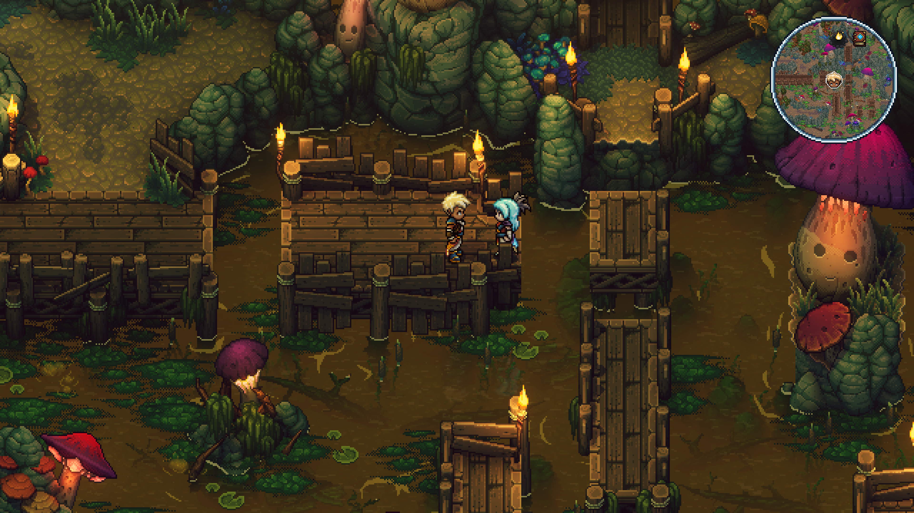
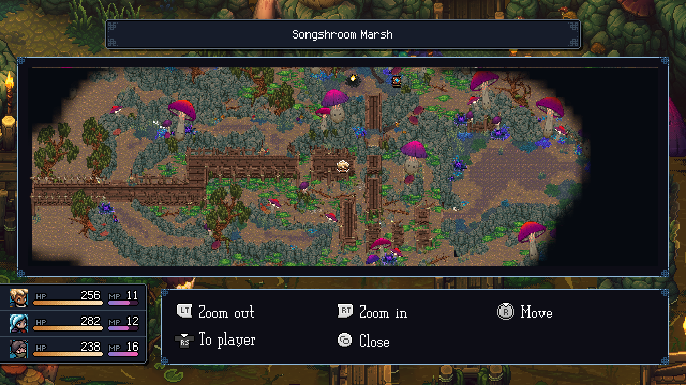
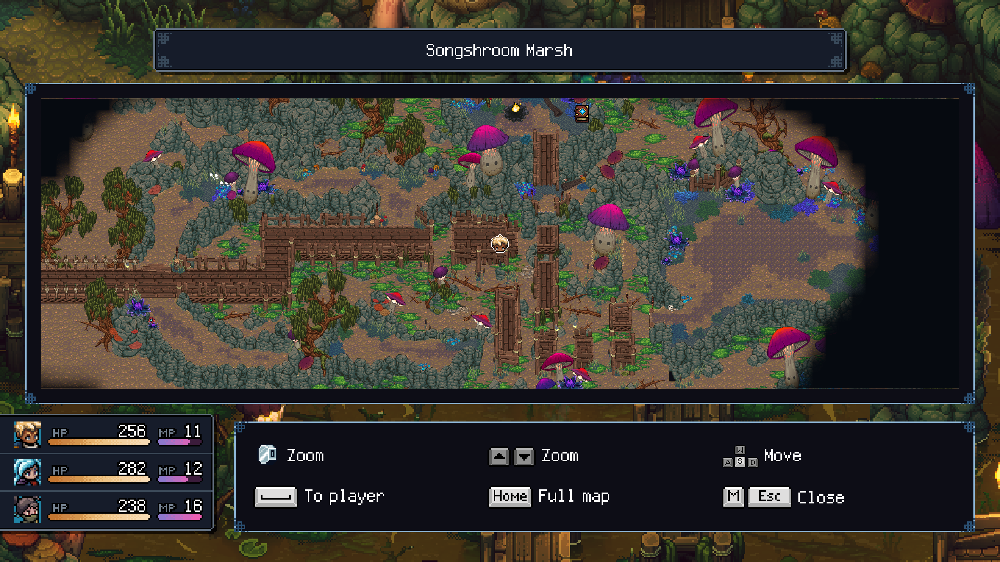

# Sea of Stars Local Map

Local Map adds a circular minimap and a full exploration map to 97 local areas in the Windows version of Sea of Stars.

The mod uses pre-rendered map geometry with persistent exploration fog. It tracks the player, reveals travelled paths, and displays discovered campfires and save points. The full map integrates with the existing location title and party status panels.

## Features

- 97 authored local maps
- Fixed-scale circular minimap
- Full map with zoom, pan, return-to-player, and fit-to-map controls
- Persistent exploration fog with continuous path reveal
- Player, campfire, and save-point markers
- Controller-first input and keyboard support
- Labels for every language supported by the game
- 512 px streamed detail tiles with a bounded texture cache
- Windows installer with package validation, rollback, verification, and removal

## Screenshots

### Circular minimap

### Full map with controller controls

### Full map with keyboard controls

## Requirements

- Sea of Stars for Windows
- BepInEx 6 for IL2CPP, including generated interop assemblies
- .NET 6 SDK for source builds
- Python 3.10 or newer with Pillow for map tooling
- .NET Framework 4 compiler for the Windows Forms installer

## Controls

| Action | Controller | Keyboard and mouse |
| --- | --- | --- |
| Open or close full map | Select/View | M |
| Zoom | LT / RT | Mouse wheel or Up / Down |
| Pan | Right stick | WASD |
| Return to player | Right-stick click | Space |
| Show whole map | — | Home |

## Install a release

Keep `LocalMapInstaller.exe` and the matching `.lmpkg` file in the same folder, then run the installer. It detects Steam libraries or accepts a manually selected folder containing `SeaOfStars.exe`.

The installer writes only to `BepInEx/plugins/LocalMap`. It does not bundle BepInEx or any other mod. Removing Local Map preserves exploration fog and settings stored outside the plug-in directory.

## Build from source

See [Building](docs/BUILDING.md). The repository intentionally excludes generated map images and extracted game UI assets. They must be prepared locally before creating an installer package.

## Architecture

See [Map design](docs/MAP-DESIGN.md) for projection, exploration, tile streaming, and UI behavior. Current validation evidence is recorded in [Verification](docs/VERIFICATION.md).

## Repository policy

Project documentation, comments, identifiers, logs, and build output are written in English. Runtime localization remains available for every supported game language.

## License

Source code is available under the MIT License. Sea of Stars and its assets are owned by their respective rights holders. 
